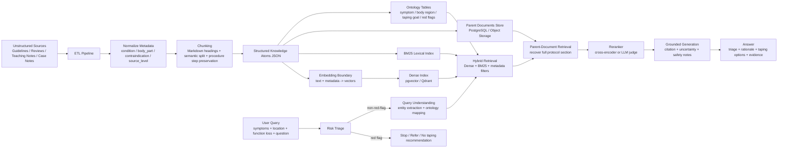

# Kinesio RAG Architecture

## 1. System Goal

建立一套面向肌肉骨骼症狀分流與肌內效貼法輔助的 RAG 系統，能在「安全邊界明確」的前提下，提供：

- 症狀到候選問題類型的可解釋分流
- 肌內效貼紮目的、禁忌、步驟與張力建議的檢索
- 附證據引用與不確定性聲明的生成答案

## 2. Architecture Diagram

## 3. Required Technical Elements

### 3.1 Data Ingestion / ETL

資料來源分四層：

1. 系統性回顧與 meta-analysis
2. 復健／運動醫學教學講義
3. 教學型貼紮 protocol 文件
4. 經人工去識別化的案例摘要

ETL 流程：

1. 匯入 PDF、Markdown、HTML、CSV
2. 抽取章節、標題、表格與步驟列表
3. 正規化 metadata
4. 切分 chunk 並保留父文件關聯
5. 轉成 knowledge atom
6. 驗證 schema
7. 寫入文件庫與向量庫

### 3.2 Embedding Model

主方案：

- `bge-m3` 或 `text-embedding-3-large`

設計理由：

- 需同時處理中英文醫學名詞
- 需支援短症狀描述與長段 protocol 文字
- 需保留 body region、movement test、contraindication 等語義近鄰

### 3.3 Vector Database Topology

建議拓撲：

- `PostgreSQL + pgvector` 作為主資料庫
- `documents`：父文件內容
- `chunks`：檢索片段與 metadata
- `chunk_embeddings`：向量欄位
- `ontology_terms`：症狀、部位、貼紮目的、禁忌詞彙
- `evaluation_cases`：離線評估題

若追求 demo 簡潔，也可改為：

- `Qdrant` 向量檢索
- `PostgreSQL` metadata 與評估資料

### 3.4 Retrieval Strategy

建議採用：

- `Hybrid Search`
  - Dense retrieval：找語義相近的症狀描述與貼法原理
  - BM25：抓明確專有名詞，如 `rotator cuff`, `patellofemoral pain`, `lymphatic contraindication`
- `Parent-Document Retrieval`
  - 先抓片段，再回收完整 protocol 區塊，避免只拿到斷裂步驟
- `Metadata Filtering`
  - body_part
  - suspected_condition
  - taping_goal
  - evidence_level
  - contraindication
- `Reranking`
  - 在召回後以 cross-encoder 或 LLM judge 重新排序

## 4. Boundary Marking

### 4.1 From Unstructured to Vectorized

非結構化資料轉向量化的邊界在 `Structured Knowledge Atoms JSON -> Embedding Boundary`。

在這之前：

- 內容仍保有原始章節、表格、條文與步驟
- 可做 schema 驗證與人工審核

在這之後：

- 文本被投影成 embedding
- 主要用於候選召回，不再是最終證據本體

### 4.2 Reranking Intervention Point

`Reranker` 介入於 `Hybrid Retrieval + Parent Retrieval` 之後、`Grounded Generation` 之前。

原因：

- 第一輪召回追求 recall
- 第二輪重排追求 relevance 與 medical safety
- 生成階段只消費已排序的高信心證據

## 5. Safety Layers

### Layer A: Query Triage

- 辨識紅旗症狀
- 如急性創傷、麻木無力、發燒、夜間持續痛、無法承重
- 命中後直接停止貼紮建議，轉為就醫提醒

### Layer B: Retrieval Guard

- 若查無高信心證據，不生成具體貼法
- 若召回內容互相衝突，明示證據不足

### Layer C: Generation Contract

- 答案必須包含 citations
- 禁止輸出超出證據範圍的確定性語句
- 禁止把教學貼紮直接包裝成診斷結論

## 6. Example Output Contract

系統回應應至少包含：

- 風險分流結果
- 候選問題類型
- 推薦或不推薦貼紮
- 具體貼法目的
- 步驟摘要
- 禁忌與警示
- 引用來源
- 不確定性聲明
